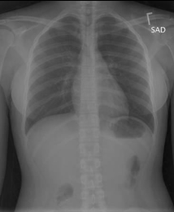
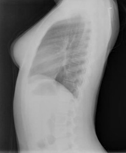

<h1 align="center">Medical Report Generation with Fine-tuned CLIP Image Encoder and Llama Style Decoder</h1>

  
  
  
  
  

# Abstract

 Chest X-ray imaging is one of the most commonly used medical imaging modalities for diagnosing various diseases, such as pneumonia and lung cancer. However, the  interpretation of these images and the generation of radiology reports require specialized expertise and can be time-consuming. Amid the increasing volume of radiological data and the limited number of radiologists, the need for systems such as Medical Report Generation (MRG), which can automatically generate radiology reports, is becoming increasingly critical. This study aims to develop an MRG model based on a Transformer encoder-decoder architecture. The encoder model employed is Contrastive Language-Image Pre-training (CLIP), which was finetuned on chest X-ray data using the Low-Rank Adaptation (LoRA) technique. The decoder is built using an architecture similar to LLaMA 3 and is trained from scratch to generate medical reports. Experimental results show that the proposed model achieved the following metrics: BLEU-1 (0.136), BLEU-2 (0.094), BLEU3 (0.052), BLEU-4 (0.028), and METEOR (0.131). The problem lies because of training the decoder from scratch and the limited amount of data were the primary challenges in this study. Although the model has yet to match the performance of existing benchmarks, its shortcomings are expected to serve as a reference for the further development of more accurate and efficient MRG systems. 

# What's makes this project different?
- Proposed a new approach to medical report generation that require less computation.
- This study handled the inconsistent data in IU XRAY dataset that haven't being handled before.

# Proposed Architecture

  

# Inconsistency Handling
### IU XRAY Dataset Overview
IU XRAY contains of 2955 chest xray from different patients. For each patient there should consist of 2 images: front and side xray. But in the exploration, we found some problems that will be stated below.

### Problems on the IU XRAY dataset
1. Every case has its own folder, and each folder can have 2-5 images. Each images will be represented with number (e.g 0, 1, 2, etc). As mentioned before, each patient folder should consist of 2 images (the front and side xray). The problem is not only 1 patient can have more than 2 images (1 patient can have more than 1 front xray), the number of the images also doesn't have a meaning (which 0 not always side xray and 1 not always front xray). 
2. The dataset consist of multiple images for one given label, which we need to do some processing to combine them together. However, the number of the images can be vary therefore we can't just stack them together. We can ignore the problem by using dot product but it will lead to huge loss of information detail.

### What We Did to Solve It?
1. Equalize all the number of images in the folder, so each folder can only have 2 images (front and side xray)
2. Made a rule for every label in the image (0 for front xray, and 1 for the side xray)
3. Randomly choose 1 photo for both of front and side xray as the baseline, then calculate the similarity score between every photos in each folders with the baseline photos using VGG-16 extractor and cosine similarity.

# Results
### Metrics
|BLEU1|BLEU2|BLEU3|BLEU4|METEOR|ROUGE|
|---|---|---|---|---|---|
|0.1366|0.0949|0.0524 |0.0281|0.1306|0.1725|

### Generated Report
|Images|Ground Truth|Prediction|
|---|---|---|
||lungs are clear . there is no pneumothorax or pleural effusion . the heart and mediastinum are within normal limits . bony structures are intact |projects developed pattern for there is no pleural effusion or pneumothorax|

# Conclusion
The proposed model, which uses a fine-tuned CLIP encoder with LoRA and a custom-built LLAMA-based decoder trained from scratch, is able to generate radiology reports from chest X-ray images. However, the generated reports are often less relevant, incomplete, and not fully aligned with the ground truth. Compared to state-of-the-art models, the proposed approach performs worse, with significantly lower scores across all metrics. Benchmark models like Clip-GPT2 achieve much higher performance, for example BLEU-1 (0.515 vs. 0.136), BLEU-2 (0.360 vs. 0.094), BLEU-3 (0.251 vs. 0.052), BLEU-4 (0.185 vs. 0.028), and METEOR (0.275 vs. 0.131). A key factor behind this performance gap is that benchmark models employ pretrained LLM decoders, while this study trained a LLAMA-like decoder from scratch with limited data, which constrained its language capabilities. Despite this, the proposed model offers a more computationally efficient alternative that could be further developed, even though its current results are not yet optimal.

